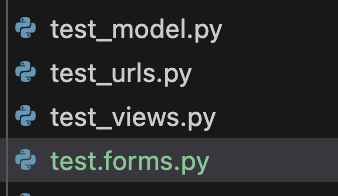
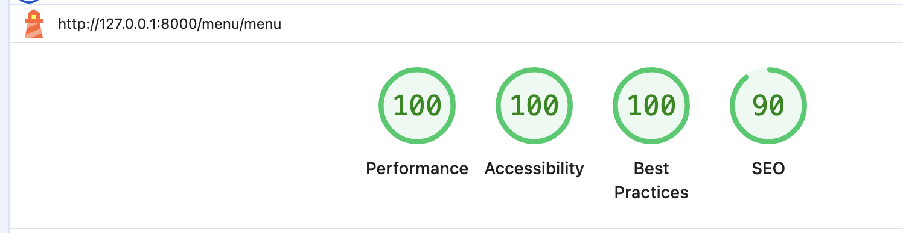
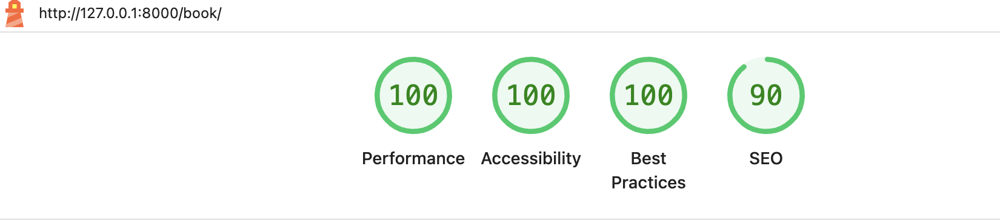
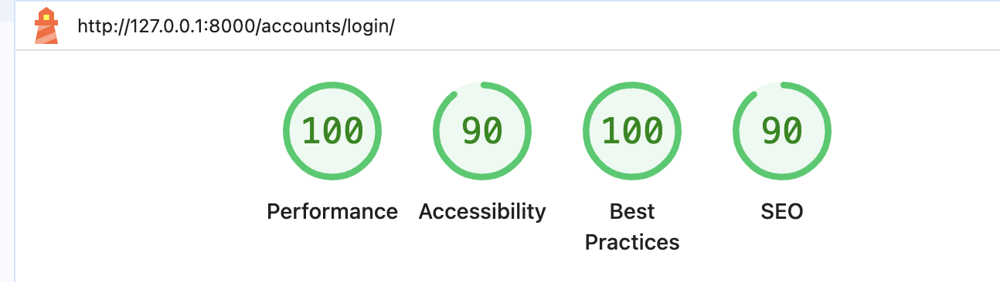
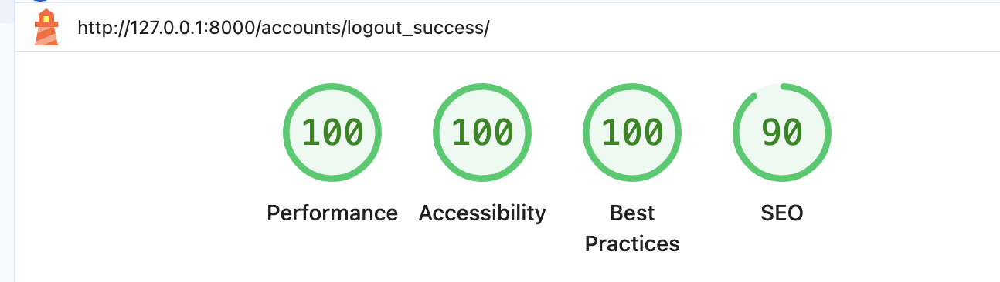

## TESTING

The program was tested constantly during its development process.
Other users also tested it in order to spot possible grammatical mistakes that the code may present.

## Manual Testing

Testing was done throughout site development, for each feature before it was merged into the master file.

Usability was tested with the below user acceptance testing, sent to new users to ensure testing from different users, on different devices and browsers to ensure issues were caught and where possible fixed during development.


| Feature    | User Action | Expected Result | Y/N | Comments |
|------------|-------------|-----------------|-----|----------|
| **Register** | Click on the **Register** link in the navbar | Redirected to Register page | Y | |
|            | Fill in valid username, password, and confirm password | Form accepts input | Y | |
|            | Submit Register form | User account created, redirected to login page with success message | Y | |
|            | Passwords do not match | Error message displayed | Y | |
|            | Leave a field blank | Error message displayed | Y | |
| **Login** | Click on the **Login** link in the navbar | Redirected to Login page | Y | |
|            | Enter valid credentials | Redirected to homepage | Y | |
|            | Enter invalid credentials | Error message displayed | Y | |
Feature |
| **Logout** | Click **Logout** in the navbar | User logged out, redirected to home page with a success message | Y | |
|            | Click back button after logout | Still logged out | Y | |
| **Bookings** | Click on **Book a Table** | Redirected to booking form | Y | |
|             | Choose past date | Not allowed, error message shown | Y | |
|             | Choose today/future date | Booking accepted | Y | |
|             | Cancel an existing booking | Booking removed, success message shown | Y | |
|             | Attempt to cancel a non-existent booking | Error handled gracefully | Y | |
| **Menu**    | Click **Menu** in navbar | Redirected to menu page | Y | |
|             | Menu images load from Cloudinary | Correct images displayed | Y | |
Feature |
| **UI/UX**   | Navbar visible on all pages | Correct navigation links displayed | Y | |
|             | Background color is `#353537` | Consistent styling across all pages | Y | |
|             | Forms styled for usability | Clean, modern design | Y | |
| **Errors/Validation** | Invalid form submissions | Error messages shown | Y | |
|             | Server error | Custom error page shown | Y | |


---

## Bugs

### Known bugs

### 1. Cancelled Booking Still Blocking Slot
- **Issue:** A cancelled booking still prevented new bookings for the same slot.  
- **Fix:** Updated conflict check in `Booking.clean()` to exclude `canceled=True`.

---

### 2. Static Image Not Loading
- **Issue:** Static image (`about_us.jpg`) not showing.  
- **Fix:** Ensured `STATICFILES_DIRS` and `` were configured correctly in settings and templates.

### Solved bugs

There were plenty of bugs during the development process since this project was a learning platform for me and allowed me to improve my skills and knowledge significantly.

However, I tried to solve the majority of them. And one of the bugs that I remember perfectly was related to the extension of the allauth Register form. I was able to solve it by customizing the allauth sign up form. Moreover, I encountered the problem of making the form work as the migrations were not working. What I have done to migrate the changes is to migrate the app first and then perform the rest of the migrations.

---

## Automated testing

### Django unit testing

As there are three main apps in the project, we can test them separately.
I knew at the very beginning that I had to implement automated testing. As I was highly concentrated on developing all functionality first, so I left testing to the end. While testing my work, I found several bugs related to the access limited to particular pages and functionality for different roles. In the future, I plan to implement testing and code simultaneously in order to increase my productivity.

**Accounts App**


**Bookings App**


**Menu**


When running the tests, the sqlite database was used.

*Needless to say, that the db.sqlite3 was not used during the development at all and the PostgreSQL database was used instead at the very beginning. And thus, db.sqlite3 **does not consist any sensitive information**. Sqlite3 is a file that is used for **testing purposes only**. It is not used in the production environment.*

I set tests folder for each app separately, which consists test_forms.py, test_models.py, test_views.py and test_urls.py each. I also deleted the test.py files from the all apps.



While developing tests I was running the following command:

```
python manage.py test <name of the app>
```

To create the coverage report, I ran the following command:

```
coverage run --source=<name of the app> manage.py test
```
```
coverage report
```
To see the html version of the report, I ran the following command:

```
coverage html
```
```
    python3 -m http.server
```
The link to the server will appear. Click the link to see the report and find out which parts of code has not been covered in testing.


---

## Validation

### HTML Validation

- [Full HTML Validation Report](documentation/validation/home.html_validation.png)

- No errors or warnings were found when passing through the official [W3C](https://validator.w3.org/) validator. This checking was done manually by copying the view page source code and pasting it into the validator.


### CSS Validation

- [Full CSS Validation Report](documentation/validation/css_validation.png)

- No errors or warnings were found when passing through the official [W3C (Jigsaw)](https://jigsaw.w3.org/css-validator/#validate_by_uri) validator, css code works perfectly on various devices.


### Python Validation

- [Full Python Validation Report]()

- No errors were found when the code was passed through code institutes python linter [online validation tool](https://pep8ci.herokuapp.com/).This checking was done manually by copying python code and pasting it into the validator.


---

## Lighthouse Report

### Home Page


### Menu Page



### Book Page



### My Bookings Page


### Login Page



### Logout Page



### Register Page


---

## Compatibility

Testing was conducted on the following browsers;

- Chrome

[Compatibility Report](documentation/compatibility_reports/compatibility_chrome_home.png)
[Compatibility Report](documentation/compatibility_reports/compatibility_chrome_menu.png)
[Compatibility Report](documentation/compatibility_reports/compatibility_chrome_book.png)
[Compatibility Report](documentation/compatibility_reports/compatibilty_chrome_login.png)
[Compatibility Report](documentation/compatibility_reports/compatibility_chrome_register.png)

- Firefox

[Compatibility Report](documentation/compatibility_reports/compatibility_firefox_home.png)
[Compatibility Report](documentation/compatibility_reports/compatibility_firefox_menu.png)
[Compatibility Report](documentation/compatibility_reports/compatibility_firefox_book.png)
[Compatibility Report](documentation/compatibility_reports/compatibility_firefox_login.png)
[Compatibility Report](documentation/compatibility_reports/compatibility_firefox_register.png)

- Safari

[Compatibility Report](documentation/compatibility_reports/compatibility_safari_home.png)
[Compatibility Report](documentation/compatibility_reports/comaptibility_safari_menu.png)
[Compatibility Report](documentation/compatibility_reports/compatibility_safari_book.png)
[Compatibility Report](documentation/compatibility_reports/compatibility_safari_login.png)
[Compatibility Report](documentation/compatibility_reports/compatibility_safari_register.png)

---

### Responsiveness 

- The websites responsiveness was checked manually by using devtools implemented in (Chrome) throughout the whole development. It was also checked with [Responsive Viewer](https://chrome.google.com/webstore/detail/responsive-viewer/inmopeiepgfljkpkidclfgbgbmfcennb/related?hl=en) Chrome extension.

[Responsiveness Report]()


---
